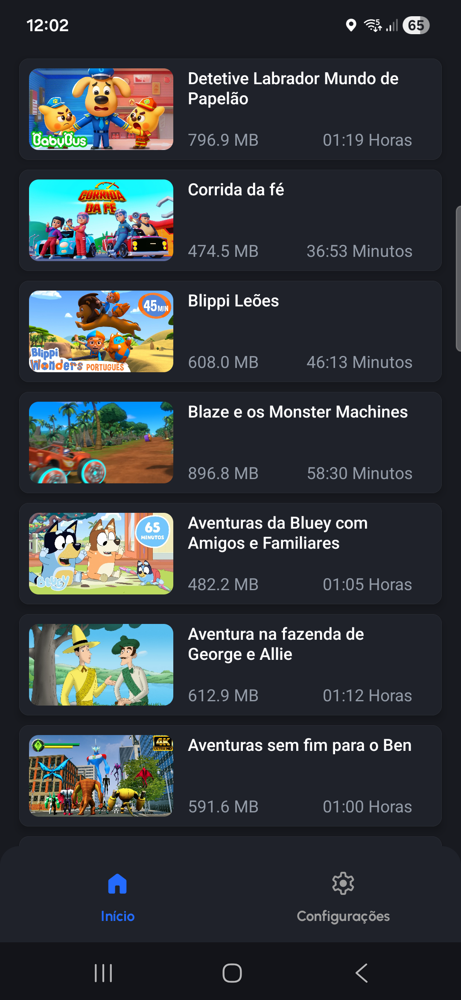
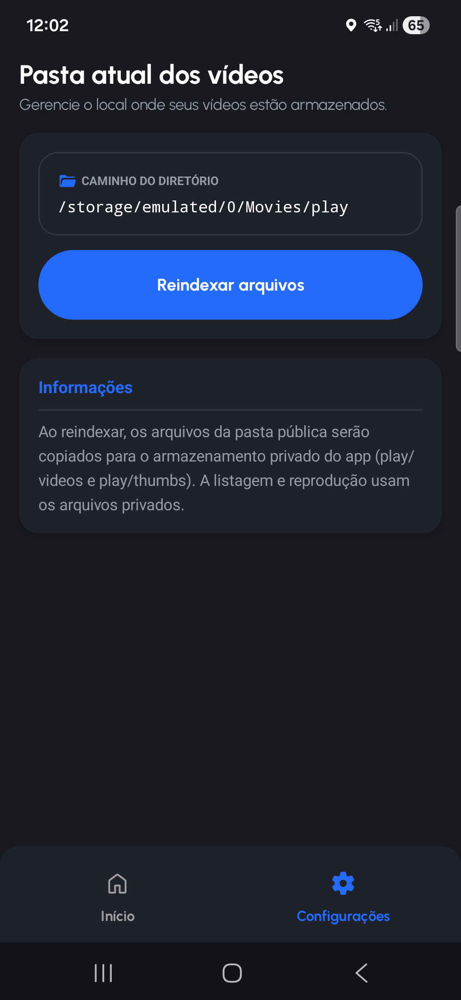
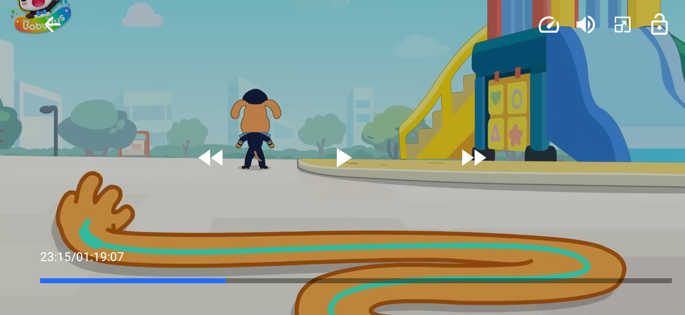

# Play

App **Compose Multiplatform** para listar e reproduzir vídeos locais no dispositivo, com foco em uma experiência simples e rápida em **Android** e **iOS**.

## Proposta

O objetivo do Play é centralizar a visualização de vídeos do aparelho em uma interface limpa, com:

- listagem dos vídeos disponíveis
- miniaturas para identificação rápida
- player em tela cheia
- fluxo de permissões para acesso aos arquivos

## Como o app funciona

1. Ao abrir o app, o usuário concede permissão para acessar a galeria/arquivos de mídia.
2. O app indexa e organiza os vídeos para uso interno.
3. A tela principal exibe a lista de vídeos encontrados.
4. Ao tocar em um item, o vídeo é aberto no player.
5. O usuário pode controlar reprodução, progresso e retorno para a lista.

## Plataformas

- Android
- iOS

## Capturas de tela

### Tela Inicial (Lista de vídeos)



### Tela de Configurações



### Tela do Player (Modo paisagem)



## Estrutura (resumo)

- `composeApp`: entrada do app Compose Multiplatform
- `androidApp`: configuração/host Android
- `iosApp`: host iOS (Xcode)
- `features`: funcionalidades (lista de vídeos, player, onboarding)
- `design`: componentes visuais compartilhados
- `core`, `domain`, `di`: base, modelos e injeção de dependência

## Executar o projeto

### Android

```bash
./gradlew :composeApp:assembleDebug
```

### iOS

Abra `iosApp/iosApp.xcodeproj` no Xcode e execute o target do app.

## Contribuições

Contribuições são bem-vindas.

Se quiser colaborar:

1. Faça um fork do repositório
2. Crie uma branch para sua feature/correção
3. Envie um Pull Request com uma descrição clara da mudança

Sugestões, melhorias de UX, otimizações e correções de bugs são muito bem-vindas.
